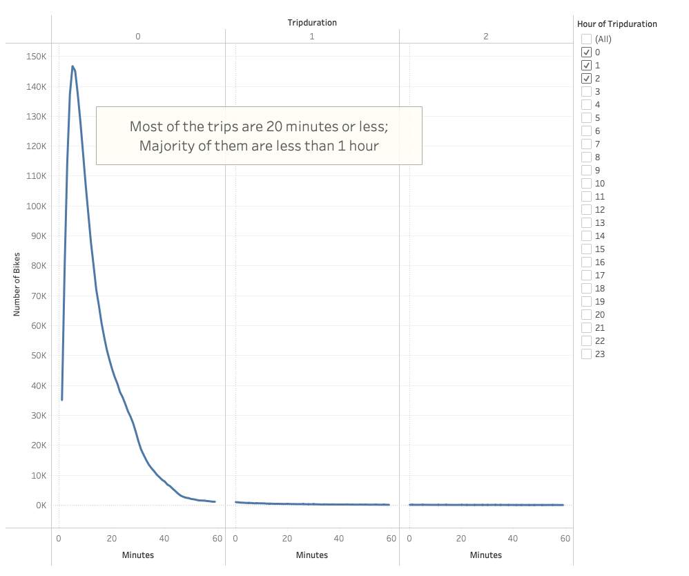
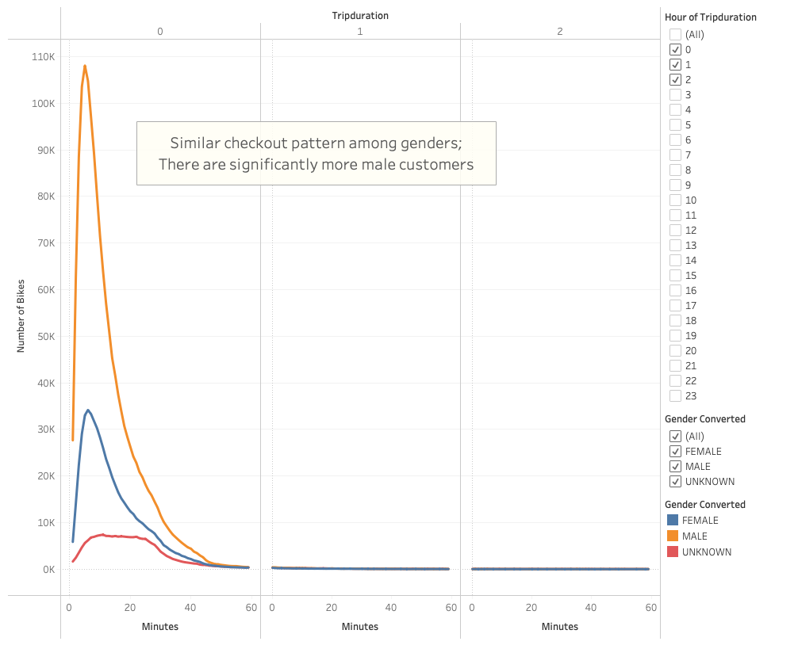
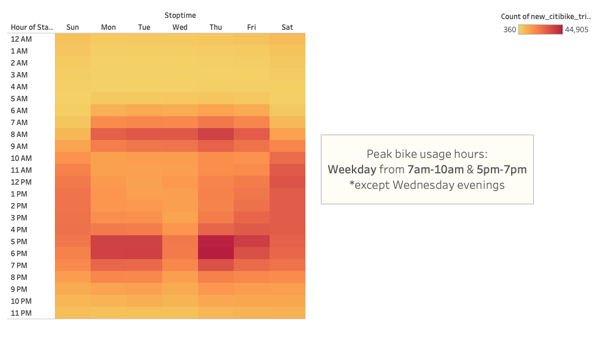
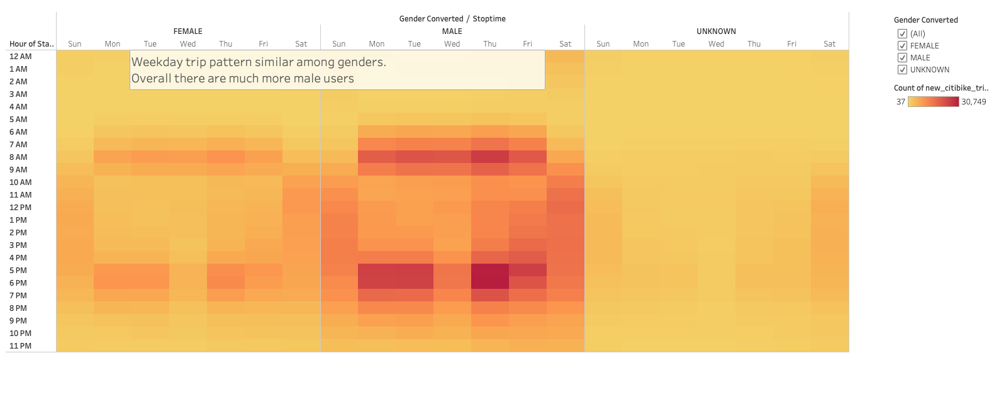
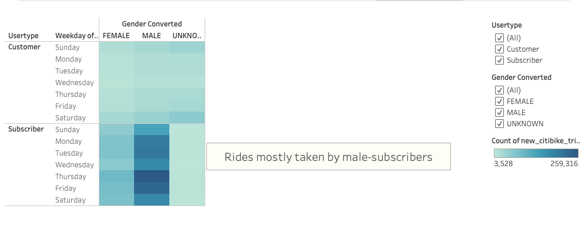
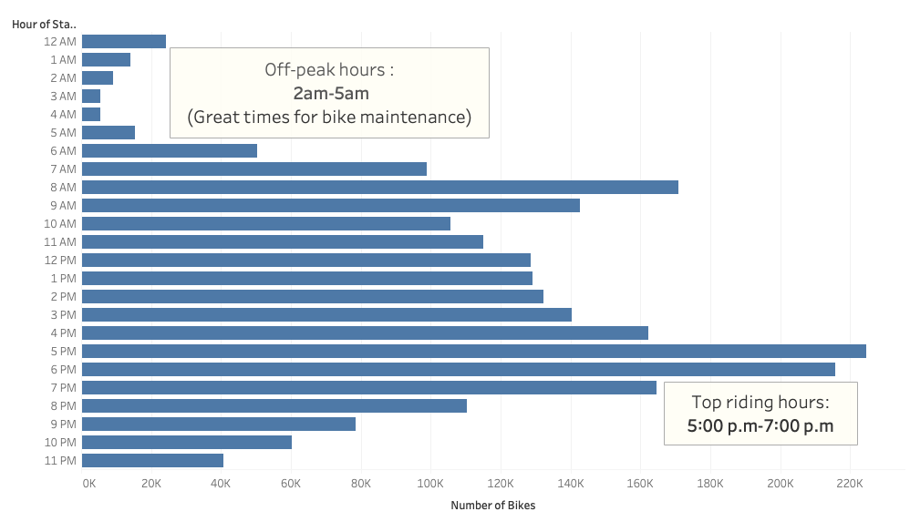
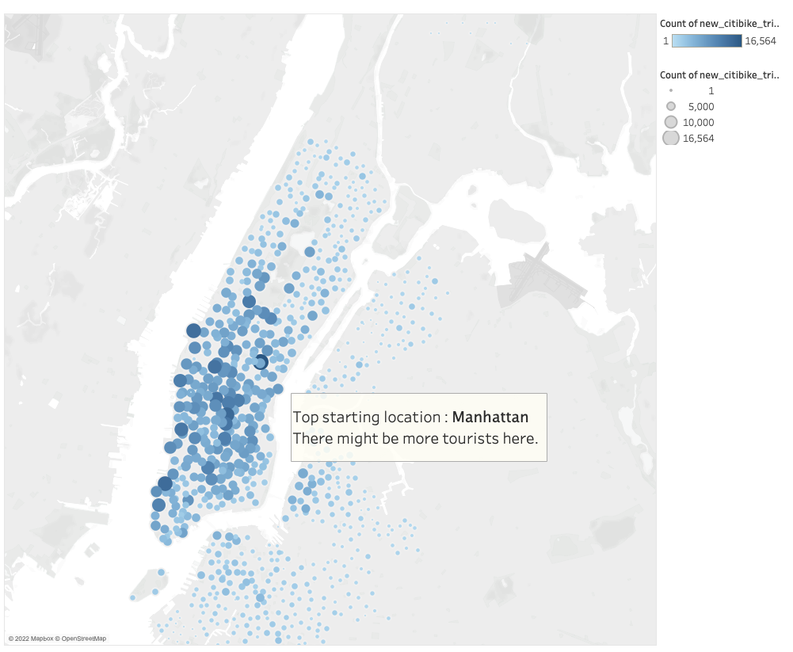

# bikesharing

# Purpose

The purpose of this analysis is to create some visualizations to convince to investors that a bike-sharing program in Des Moines is a solid business proposal. We will analyze the New York City Citibike data from August 2019 in order to gain insights on how the citibike business could success. Specifically, we would like to present some findings on bike trip analysis.  

To break it down, we have prepared the following set of visualizations to:

Show the length of time that bikes are checked out for all riders and genders
Show the number of bike trips for all riders and genders for each hour of each day of the week
Show the number of bike trips for each type of user and gender for each day of the week.

# Results

Please click here [link to dashboard](https://public.tableau.com/app/profile/susan.han6689/viz/Story_16487780404100/Story1) to view full Story on Tableau Public. 

## 1. Checkout Times for Users

Tableau Link [link to dashboard](https://public.tableau.com/views/CheckoutTimesforUsersViz_16487774119430/CheckoutTimesforUsers?:language=en-US&:display_count=n&:origin=viz_share_link)

This graph shows the number of trips and tripduration taken by users. We see the peak between 0-20 minutes in the first hour (the first column). This suggests that most of the trips are 20 minutes or less, and vast majority of trips are less than 1 hour. 

## 2. Checkout Times by Gender

Tableau Link [link to dashboard](https://public.tableau.com/views/CheckoutTimesbyGenderViz_16487774755020/CheckoutTimesbyGender?:language=en-US&:display_count=n&:origin=viz_share_link)

This graph breaks down the number of rides by gender. It is clear that the tripduration pattern is the same among genders but there are way more male users in our result. 

## 3. Trips by Weekday for Each Hour

Tableau Link [link to dashboard](https://public.tableau.com/views/TripsbyWeekdayforEachHourViz_16487775404050/TripsbyWeekdayperHour?:language=en-US&:display_count=n&:origin=viz_share_link)

This heapmap helps to show weekly bike usage patterns. The peak bike usage hours are on weekday commute times, from morning 7am-10am and afternoon 5pm-7pm, except on Wednesday evenings. On the other hand, weekend usage is quite evenly spreadout throughout the daytimes.

## 4. Trips by Gender (Weekday per Hour)

Tableau Link [link to dashboard](https://public.tableau.com/views/TripsbyGenderWeekdayperHourViz_16487777550590/TripsbyGenderWeekdayperHour?:language=en-US&:display_count=n&:origin=viz_share_link)

This heapmap breaks down the weekday usage patterns further by genders. We see similar usage pattern among genders, where peak usage is in weekday commute times from morning 7am-10am and afternoon 5pm-7pm (except Wednesday evenings). However, the number for male users is considerably higher. 

## 5. User Trips by Gender by Weekday

Tableau Link [link to dashboard](https://public.tableau.com/views/TripsbyGenderbyWeekdayViz_16487778109870/UserTripsbyGenderbyWeekday?:language=en-US&:display_count=n&:origin=viz_share_link)

This heatmap breaks down the weekly trip pattern further by gender and by subscriber status. There are more subscriber users than general customers, and of the subscribers there are much more male users. 

## 6. August Peak Hours 

This horizontal bar graph displays the number of bike rides started during each hour of the day in the month of August. It was found that top riding start hours are 5pm-7pm; while the low-usage hours are between 2am-5am. The off-peak hours could potentially be the best times to conduct bike repair and maintenance works. 

## 7. Top Starting Locations

The map shows locations from where bike trips are started. The larger size and darker color of circles indicate greater number of trips started at those locations. It seems that Manhattan area in NYC is a popular location for citibike trips. One possible reason could be the higher amount of tourists visiting the area who would ride citibikes. 

# Summary

The analysis on NYC Citibike data have provided great insights on bike-sharing program business. We know that most bike trips are short less than 1 hour, and peak checkout times are actually within 20 minutes. We then discovered the usage pattern by time and by gender. On weekdays the peak bike usage hours are on commute times from morning 7am-10am and evening 5pm-7pm; and on weekends it's more evenly spreadout during daytimes. Of the users, there are more male subscribers that ride citibikes. From analyzing the trips during each hour of the day, we found that 2am-5am are the lowest usage hours which could be ideal for bike maintenance. Lastly, citybikes are more popular in areas where there may be more tourists, thus we could assign more bikes around those locations.

## Two additional visualizations recommended:

1) We could try find the relationship between the number of trips taken and their age, and find out whether citibike is more favorable in a certain age group.
2) We could try break down the top starting locations by gender to findout where each gender prefer to start their trips.

